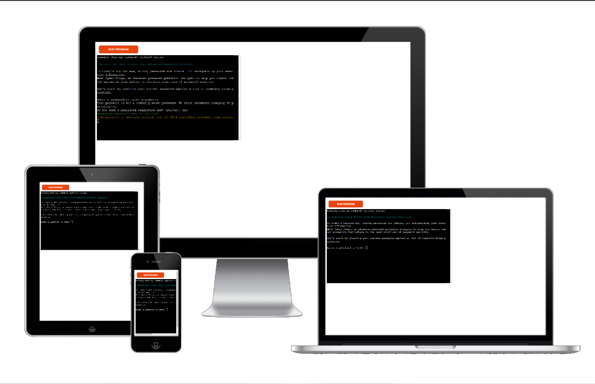

# Cyber-Forge: Advanced Password Generator



----

# Table of Contents
` ` `
- [Repository](#repository)
- [Introduction](#introduction)
- [How to Use Cyber-Forge](#how-to-use-cyber-forge)
- [Getting Started](#getting-started)
  - [Prerequisites](#prerequisites)
  - [Usage](#usage)
- [Project Requirements](#project-requirements)
- [Features](#features)
  - [Password Validation](#password-validation)
  - [Password Generation](#password-generation)
  - [Password Entropy Calculation](#password-entropy-calculation)
  - [Password Uniqueness](#password-uniqueness)
- [User Stories](#user-stories)
- [Technologies Used](#technologies-used)
- [Development and Deployment](#development-and-deployment)
- [Testing](#testing)
- [Accreditation](#accreditation)
- [Credits](#credits)
- [Author](#author)
` ` `

----

# Repository

[GitHub Repository](https://github.com/hypergeek-dev/cipher-forge)

Live at: [https://cipher-forge.herokuapp.com/](https://cipher-forge.herokuapp.com/)

# Introduction

In today's digital age, strong passwords are crucial for safeguarding your sensitive information. Meet Cyber-Forge, an advanced password generator designed to help you create robust passwords that adhere to the best practices of password security.

# Features

## Common Password Validation

Cyber-Forge checks if your password is a commonly known password and suggests changing it if necessary.

- Enter a password to test its commonness.
- Receive feedback on whether the password is commonly known or not.

## Password Generation

If you want a new password suggestion, Cyber-Forge can generate a strong and unique password for you.

- Choose whether to generate a new password suggestion.
- A strong and unique password will be generated and displayed.

## Password Uniqueness

Cyber-Forge calculates the number of possible combinations for the generated password, giving you an idea of its uniqueness.

# Getting Started

## Prerequisites

1. Clone or download this repository and navigate to the project directory.
2. Make sure you have the following installed:
   - Python (version 3.7 or above)
   - colorama library
   - humanize library

   I have simplified installing the dependencies through using a script. Copy/paste and run this in your terminal:

   ```shell
   chmod +x setup.sh ; ./setup.sh
   ```
3. run
    ```shell
    run.py
   ```


# Project Requirements

This project is the third of five milestone projects that need to be completed to obtain the Full Stack Development Diploma from Code Institute. The required technology for this project is Python.

## Features

- **Password Validation**: Cyber-Forge validates your password against a list of commonly known passwords.
- **Password Generation**: Cyber-Forge can generate a strong and unique password for you.
- **Password Entropy Calculation**: Your generated password has the possibility to be calculated in strength and assessed.
- **Password Uniqueness**: Cyber-Forge calculates the number of possible combinations for the generated password, giving you an idea of its uniqueness.

# User Stories

- As a user, I want to generate strong and secure passwords to protect my sensitive information.
- As a user, I want to check if my current password is commonly known and receive recommendations to change it if necessary.
- As a user, I want the option to generate a password suggestion based on advanced password generation techniques.
- As a user, I want the generated password to adhere to the best practices of password security.
- As a user, I want to understand the uniqueness and strength of the generated password in terms of the number of possible combinations.
- As a user, I want the password generator to be easy to use with clear instructions and prompts.

# Technologies Used

- Python
- colorama library
- humanize library

# Development and Deployment

The development environment used for this project was GitPod. Regular commits and pushes to GitHub were conducted to track the development stage and handle version control. The live version of the project was deployed using Heroku.

To generate the wordlist, I created a simple web scraper in Python, which is added in this repository. With that scraper, I was able to create lists of 3-letter words and 4-letter words. Accreditation for those words is mentioned in a later section of this page.

## My criteria for password generation

- **Length**: Longer passwords are generally more secure. It is often recommended to use passwords with a minimum length of 8 characters or more, as stated in the guidelines formed by NIST Special Publication 800-63B.
- **Complexity**: Passwords should include a combination of uppercase and lowercase letters, numbers, and special characters.
- **Avoid Sequential or Repeated Patterns**: Passwords should not include sequential or repeated characters or patterns.
- **Randomness**: Passwords should be generated using a strong random number generator to ensure unpredictability.

# Testing

 CI Python Linter on https://pep8ci.herokuapp.com/ gave following results


### 1. Run
3 occasions of "expected 2 blank lines, found 1"
9 occasions of "line too long (100 > 79 characters)"

### 2. Run
### Results:
All clear, no errors found

# Accreditation
I like to thank dictionary.com for the wordlists i gained from accessing their website.
and Nordpass.com for their list of 200 most used passwords
I also like to thank Iocane.com for the scale on passwords-trength measured in bits
And omnicalculator.com for the formular on how to calculate Entropy

# Credits
For code inspiration, help, and advice, the following resources were used:
#### Martina Terlevic
#### Code institute
#### Online references about industrial standards
#### Youtube with guides on how-to.


# Author
Cyber-Forge was developed by Dennis Jensen.
