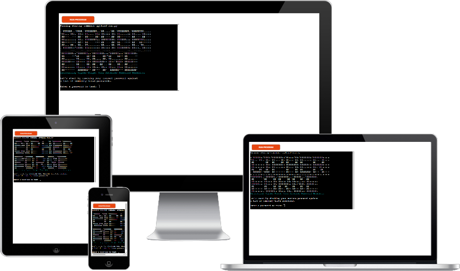

# Cyber-Forge: Advanced Password Generator



----

# Table of Contents

- [Repository](#repository)
- [Introduction](#introduction)
- [Features](#features)
  - [Common Password Validation](#common-password-validation)
  - [Password Generation](#password-generation)
  - [Password Uniqueness](#password-uniqueness)
- [Getting Started](#getting-started)
  - [Prerequisites](#prerequisites)
- [User Stories](#user-stories)
- [Technologies Used](#technologies-used)
- [Development and Deployment](#development-and-deployment)
  - [Creating the wordlists](#creating-the-wordlists)
  - [Criteria for password generation](#criteria-for-password-generation)
- [Testing](#testing)
  -[Bugs](#bugs)
   - [Error Handling](#error-handling)
   - [Exception Handling](#exception-handling)
   - [Looping](#looping)
- [Accreditation](#accreditation)
- [Credits](#credits)
- [Author](#author)

----

# Repository

[GitHub Repository](https://github.com/hypergeek-dev/cipher-forge)

Live at: [https://cipher-forge.herokuapp.com/](https://cipher-forge.herokuapp.com/)

# Introduction

In today's digital age, strong passwords are crucial for safeguarding your sensitive information. Meet Cyber-Forge, an advanced password generator designed to help you create robust passwords that adhere to the best practices of password security.

# Features

## Common Password Validation

Cyber-Forge checks if your password is a commonly known password and suggests changing it if necessary.

- Enter a password to test its commonness.
- Receive feedback on whether the password is commonly known or not.

## Password Generation

If you want a new password suggestion, Cyber-Forge can generate a strong and unique password for you.

- Choose whether to generate a new password suggestion.
- A strong and unique password will be generated and displayed.

## Password Uniqueness

Cyber-Forge calculates the number of possible combinations for the generated password, giving you an idea of its uniqueness.

# Getting Started

## Prerequisites

1. Clone or download this repository and navigate to the project directory.
2. Make sure you have the following installed:
   - Python (version 3.7 or above)
   - colorama library
   - humanize library

   I have simplified installing the dependencies through using a script. Copy/paste and run this in your terminal:

   ```shell
   chmod +x setup.sh ; ./setup.sh
   ```
3. Run this in the terminal
    ```shell
    run.py
   ```

# User Stories

- As a user, I want to generate strong and secure passwords to protect my sensitive information.
- As a user, I want to check if my current password is commonly known and receive recommendations to change it if necessary.
- As a user, I want the option to generate a password suggestion based on advanced password generation techniques.
- As a user, I want the generated password to adhere to the best practices of password security.
- As a user, I want to understand the uniqueness and strength of the generated password in terms of the number of possible combinations.
- As a user, I want the password generator to be easy to use with clear instructions and prompts.

# Technologies Used

- Python
- colorama library
- humanize library

# Development and Deployment

The development environment used for this project was GitPod. Regular commits and pushes to GitHub were conducted to track the development stage and handle version control. The live version of the project was deployed using Heroku.

<ul>
  <li>I logged in to my Heroku account on heroku.com.</li>
  <li>From the Heroku dashboard, I clicked on the "New" button and selected "Create new app" to start creating a new app.</li>
  <li>I chose the name "Cipher-forge" for my app and clicked on the "Create app" button.</li>
  <li>On the app's page, I navigated to the "Settings".</li>
  <li>I scrolled down to the "Config Vars" section and clicked on the "Reveal Config Vars" button.</li>
  <li>Here, I added any necessary environment variables required for my app. I added a key-value pair with KEY as "PORT" and VALUE as 8000.</li>
  <li>In the "Settings" section, I clicked on the "Add buildpack" button.</li>
  <li>I added the required buildpacks Node.js. and Python</li>
  <li>Moving to the "Deploy" I selected "GitHub" as the deployment method to connect my Heroku app with my GitHub repository.</li>
  <li>Clicking on the "Connect to GitHub" button, I authenticated my GitHub account to grant Heroku access.</li>
  <li>Once connected, I searched for and selected my repository "hypergeek-dev/cipher-forge" to deploy.</li>
  <li>I chose the branch I wanted to deploy and enabled automatic deploys.</li>
  <li>I also pressed manually deployment for the first run.</li>
  <li>Heroku started deploying my app based on the selected branch, and I monitored the deployment progress in the activity logs.</li>
  <li>After the deployment completed, Heroku provided me with the URL of my deployed app:<br>https://cipher-forge.herokuapp.com</li>
</ul>

## Creating the wordlists
To generate the wordlist, I utilized a simple web scraper I also created in Python. The code for the web scraper was added to the repository, creating the possibility for others to create their own wordlists.

I created two separate lists—one for 3-letter words and another for 4-letter words.

The program scraped the desired words based on their letter count. It navigated through the website's content, extracting the necessary information and compiled the wordlists.

It is worth mentioning that the wordlists generated using the web scraper deserve proper accreditation, it is therefore also mentioned in [Accreditation](#accreditation).

## Criteria for password generation

- **Length**: Longer passwords are generally more secure. It is often recommended to use passwords with a minimum length of 8 characters or more, as stated in the guidelines formed by NIST Special Publication 800-63B.
- **Complexity**: Passwords should include a combination of uppercase and lowercase letters, numbers, and special characters.
- **Avoid Sequential or Repeated Patterns**: Passwords should not include sequential or repeated characters or patterns.
- **Randomness**: Passwords should be generated using a strong random number generator to ensure unpredictability.

# Testing

 CI Python Linter on https://pep8ci.herokuapp.com/ gave following results

### 1. Run
#### 3 occasions of "expected 2 blank lines, found 1"
#### 9 occasions of "line too long (100 > 79 characters)"

### 2. Run
### **Results:**
All clear, no errors found

## Bugs
Through testing, I discovered some potential issues in the code and made some changes to prevent errors caused by incorrect user input:

1. When user is requested to enter a digit, I modified the code to only accept the range requested. 
2. I modified the program to only accept input with a minimum of one character and exclude CTRL or Fn combinations.

### **Error Handling**
I added a safety measure to handle errors in certain parts of the code. For example, when the user enters an invalid number, I made sure the program doesn't break and instead asks them to enter a valid number.

### **Exception Handling**
I made modifications to a specific function to address a particular problem. If the user provides a passphrase length that is not allowed, I now inform them about the valid range instead of proceeding with incorrect input.

### **Looping***
 To avoid any problems caused by incorrect input, I added loops to the code. This way, if the user enters something wrong, they are prompted again until they provide the correct input.

# Accreditation
I like to thank dictionary.com for the wordlists i gained from accessing their website.
and Nordpass.com for their list of 200 most used passwords.
I also like to thank Iocane.com for the scale on passwords-strength measured in bits.
And omnicalculator.com for the formular on how to calculate Entropy.

# Credits
For code inspiration, help, and advice, the following resources were used:
#### **Martina Terlevic**
#### **Code institute**
#### **Online references about industrial standards**
#### **Youtube with guides on how-to**


# Author
Cipher-Forge was developed by **Dennis Jensen**.
